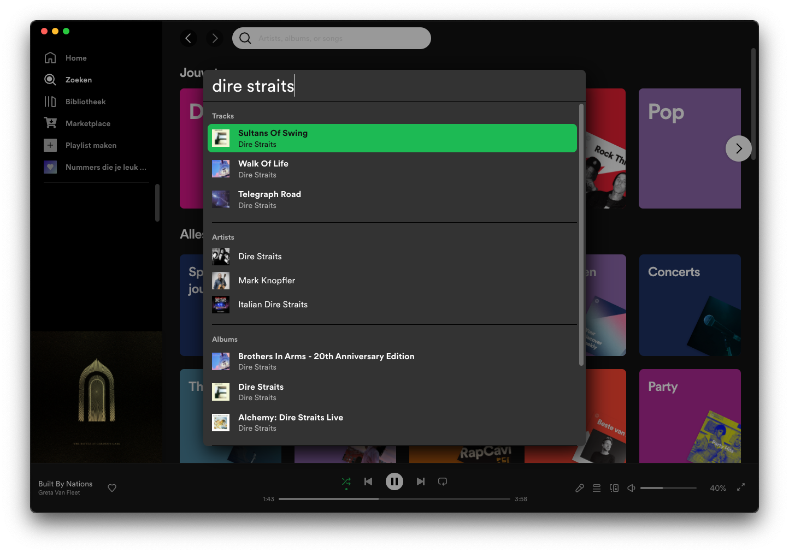

# Spicetify power bar
Spotlight-like quick search bar to navigate to tracks, albums, artists and playlists.



## Table of contents
  - [Installation](#installation)
  - [Usage](#usage)
  - [Settings](#settings)
  - [Theme](#theme)

## Installation
Install via [spicetify-marketplace](https://github.com/CharlieS1103/spicetify-marketplace).

Or the manual way:  
Copy [power-bar.js](https://github.com/jeroentvb/spicetify-power-bar/blob/dist/power-bar.js) (from the [dist branch](https://github.com/jeroentvb/spicetify-power-bar/tree/dist)) to the spicetify extenstions folder
| **Platform**    | **Path**                               |
|-----------------|----------------------------------------|
| **MacOs/Linux** | `~/.config/spicetify/Extensions`       |
| **Windows**     | `%userprofile%/.spicetify/Extensions/` |

Run the following commands
```sh
spicetify config extensions power-bar.js
spicetify apply
```

## Usage
Activate using the shortcut. These are defaults. Can be changed in the [settings](#settings).
| **Platform**      | **Shortcut** |
|-------------------|--------------|
| **Windows/Linux** | `ctrl+space` |
| **MacOs**         | `alt+space`  |

In the suggestion list you can jump back and forth between categories by pressing `tab` and `shift+tab`.

To play a suggestion immediately (not navigating to it), hold `ctrl` (windows/linux) or `cmd` (macOs) when selecting the suggestion.

## Settings
Settings for the power bar can be found on spotify's settings page. There are settings for the following things:
* **Activation key combo**. Defaults are `alt+space` on MacOs, and `ctrl+space` on other operating systems. Can be changed to anything in to following format: `modifier+key`. A modifier key is one of the following: 
  * Shift
  * Control
  * Alt
  * Cmd/Windows
* **Amount of suggestions per category**. How many suggestions to show per per category. Default is 3. Technically this can be set to 50, but in the power bar it's limited to 10 per category due to it being a better user experience.
* **Add to queue**. Add the selected suggestion to the queue instead of playing it. When enabled hold `ctrl` (windows/linux) or `cmd` (macOs) when selecting the suggestion to add it to the playback queue. 

## Theme
To change the colors of the power bar add the following css to your theme (or ask the creator to add styles for power bar). Be sure to change to color values to the desired colors.  
Alternatively you can add css by creating a snippet using the [marketplace](https://github.com/spicetify/spicetify-marketplace), or [css-editor](https://github.com/FlafyDev/spotify-css-editor).

```css
#power-bar-container {
  --power-bar-background-color: #333333;
  --power-bar-main-text-color: #ffffff;
  --power-bar-subtext-color: #b3b3b3;
  --power-bar-active-background-color: #1db954;
  --power-bar-active-text-color: #121212;
  --power-bar-border-color: #000000;
}
```
